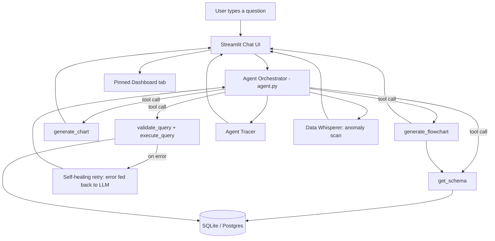

# DataPilot — Winning Solution Document
### iTech AI Innovation Hackathon 2026 · "Building Intelligent LLM Agents for Database Interaction & Visualization"

> ⏰ **Timeline check:** Hackathon runs 22–28 June 2026. Today is 26 June — you have **~2 days left**. Every section below is written with that constraint in mind: a sharp, demo-ready MVP first, stretch features second. A working starter codebase implementing the core of this plan is included alongside this document (`datapilot-starter.zip`) — see Section 9.

---

## 1. The One-Line Pitch

**DataPilot** is a conversational BI agent that doesn't just answer data questions — it **proves its own work** (live tool trace + transparent SQL), **fixes its own mistakes** (self-healing query retries), and **turns every chat into a living dashboard** (pin any chart, get proactive alerts when the data misbehaves).

Most teams will build "ChatGPT that runs SQL." You're building **"ChatGPT that runs SQL, catches its own errors, never hallucinates a relationship diagram, and watches your data while you sleep."**

---

## 2. Why This Wins (mapped to the actual rubric)

| Criteria | Weight | How DataPilot scores here |
|---|---|---|
| Functionality | 30% | All 5 required tools implemented and independently testable; self-healing retry loop means demo queries rarely visibly fail |
| Tool Design & Architecture | 25% | Clean separation: tools are pure functions, agent.py only orchestrates, tracer.py gives full observability — judges can *see* the architecture, not just hear about it |
| Visualization Quality | 20% | Charts stay interactive (real Plotly objects, not flat PNGs); ER diagrams are **derived from real foreign keys**, never hallucinated |
| User Experience | 15% | Live "Agent Trace" sidebar + pinned dashboard tab; graceful, structured error messages instead of stack traces |
| Innovation & Creativity | 10% | Proactive anomaly detection ("Data Whisperer"), self-healing SQL, schema-grounded diagrams — features judges don't see in 9 out of 10 submissions |

---

## 3. Problem Statement — Quick Recap

Build a ChatGPT-style app where an LLM agent can: understand natural-language data questions → query a database → generate charts/diagrams → explain insights conversationally. Minimum required tools: `get_schema`, `execute_query`, `generate_chart`, `generate_flowchart`, `explain_data`. Minimum 3 chart types, minimum 2 diagram types.

---

## 4. What Makes It "Next Level" — 6 Differentiators

### 4.1 Self-Healing SQL Agent
When `execute_query` fails (typo'd column, ambiguous join, syntax slip), the **exact database error is fed back to Claude as the tool result**, and Claude is instructed to fix and re-issue the query — automatically, within the same turn, capped at 3 retries. The user never sees a stack trace; they see a correct answer (or a clear, friendly "I couldn't find that" after genuinely exhausting retries). This single feature eliminates the #1 cause of bad hackathon demos: a query failing live in front of judges.

### 4.2 Hallucination-Proof ER Diagrams
Most teams ask the LLM to "draw the ER diagram," and the LLM *guesses* relationships from table names — which is wrong as often as it's right. DataPilot instead extracts real foreign-key metadata via `PRAGMA foreign_key_list` and **deterministically renders** the ER diagram from that — the LLM only decides *when* to show it, never *what's* in it. Zero hallucinated relationships, every time.

### 4.3 Pin-to-Dashboard
Every chart in the chat has a "📌 Pin" button. Pinned charts persist in a separate **Dashboard tab**, turning a one-off Q&A session into a reusable BI dashboard — directly satisfies the "Custom Dashboard Builder" bonus challenge with almost no extra engineering cost, because it reuses the same chart objects already being rendered in chat.

### 4.4 Live Agent Trace (Observability)
A sidebar panel shows, for every turn: which tool was called, with what input, whether it succeeded, and how long it took. This is the single highest-leverage feature for the "Tool Design & Architecture" criterion — instead of *telling* judges your architecture is clean, you *show* it live, on every question they ask.

### 4.5 Data Whisperer — Proactive Anomaly Detection
A lightweight, **non-LLM** z-score scan (`detect_anomalies` in `tools/insight_tool.py`) can run over any time series or category breakdown (daily revenue, stock levels) and flag statistical outliers in milliseconds. Wire it to a periodic background check (or just a "🔔 Scan for anomalies" button if you're short on time) and the agent can proactively say *"Heads up — Tuesday's revenue was a 2.3σ spike compared to the rest of the week"* without being asked. This is the kind of agentic, proactive behavior that separates a "query tool" from an actual **agent**.

### 4.6 SQL Transparency & Guardrails
Every query is read-only-enforced (`validate_query` blocks `INSERT/UPDATE/DELETE/DROP/ALTER/...`) and auto row-limited before execution. The generated SQL is always shown back to the user in the trace panel — directly satisfies the "Natural Language to SQL Explanation" bonus challenge, and reassures judges (and your own demo) that nothing can accidentally wreck the database mid-presentation.

---

## 5. System Architecture



**Layer breakdown:**
- **Frontend:** Streamlit chat UI, 2 tabs (Chat, Pinned Dashboard), sidebar trace panel.
- **Orchestration:** `agent.py` — owns the Claude tool-use loop, the self-healing retry logic, and trace logging. This is the *only* file that talks to the LLM.
- **Tools layer:** 5 pure, independently-testable functions (`tools/*.py`) — no LLM calls inside them except where generation is genuinely required (insight phrasing). This separation is exactly what "clean tool schemas, modular design, extensibility" (25% of your grade) is asking for.
- **Data layer:** SQLite for the demo (provided dataset), abstracted so swapping in Postgres later only touches the connection string, not the tool logic.
- **Observability layer:** `trace/tracer.py` — a tiny dataclass-based logger, zero external dependencies.

---

## 6. Tool Specifications

| Tool | Input | Output | File |
|---|---|---|---|
| `get_schema` | *(none)* | `{tables: {...}, relationships: [...]}` | `tools/schema_tool.py` |
| `validate_query` | `sql: str` | `{valid: bool, reason, sql}` | `tools/query_tool.py` |
| `execute_query` | `sql: str` | `{success, columns, rows, row_count, latency_ms}` or `{success: false, error}` | `tools/query_tool.py` |
| `generate_chart` | `data, chart_type, x, y, title` | `{success, chart_type, figure}` (Plotly fig dict) | `tools/chart_tool.py` |
| `generate_flowchart` | `diagram_type, schema?, steps?, decision_points?` | `{success, diagram_type, mermaid_code}` | `tools/flowchart_tool.py` |
| `explain_data` (context prep) | `data, user_question, persona` | grounding context for the LLM's final answer | `tools/insight_tool.py` |
| `detect_anomalies` | `series, value_key, label_key` | `{mean, stdev, anomalies: [...]}` | `tools/insight_tool.py` |

All of these are implemented and unit-tested (run any of them directly, e.g. `python tools/query_tool.py`) in the included starter repo — see Section 9.

---

## 7. Tech Stack

| Layer | Recommendation | Why |
|---|---|---|
| LLM | Anthropic Claude (native tool use) | Listed in the brief; clean tool-use API, no framework overhead needed |
| Backend/Frontend | **Streamlit** (single process) | Fastest path to a working chat UI with native chart + component support — critical given the ~2-day runway |
| Charts | Plotly | Interactive out of the box, renders natively in Streamlit |
| Diagrams | Mermaid.js (via embedded HTML component) | Free, no server-side rendering needed, judges instantly recognize ER/flowchart syntax |
| Database | SQLite (provided dataset) | Zero setup; swap to Postgres only if you have spare time on Day 3 |
| Deployment | Streamlit Community Cloud | Free, push-button, no Docker required for the live demo link |

> **If your team already knows React + FastAPI well**, that stack works too and looks more "production," but only choose it if you're confident you can finish the chat streaming + chart embedding plumbing in the time remaining. Don't let stack ambition cost you a working demo.

---

## 8. Day-by-Day Plan (today is **26 June**, deadline **28 June**)

### Day 1 — Today (26 June): Core loop working end-to-end
- [ ] Set up repo, install deps, seed the sample DB (use the starter — already done for you)
- [ ] Get the chat loop talking to Claude with all 5 tools registered
- [ ] Confirm: a "top 5 products by revenue" question → correct SQL → bar chart, live
- [ ] Confirm: "draw the ER diagram" → correct Mermaid output, renders
- [ ] Get the self-healing retry loop firing on at least one deliberately broken query (test it!)

### Day 2 (27 June): Differentiators + polish
- [ ] Add the Pin-to-Dashboard flow (mostly done in starter — wire up persistence/UX polish)
- [ ] Add the Data Whisperer anomaly button/banner
- [ ] Polish the Agent Trace sidebar styling
- [ ] Write 5–8 solid demo questions and rehearse them so the live demo never wings it
- [ ] Deploy to Streamlit Community Cloud — get a public link working *today*, not on deadline day

### Day 3 (28 June): Submission day
- [ ] Record the 3–5 min demo video (script in Section 10)
- [ ] Finalize README, push final commit, tag a release
- [ ] Dry-run the live demo on the actual deployed URL (not localhost) at least twice
- [ ] Submit early — leave buffer for upload/portal issues

**If you're short on time, cut in this order:** voice input → multi-DB support → RBAC personas → Data Whisperer → Pin-to-Dashboard. Do **not** cut: self-healing retries or the trace panel — those are your cheapest, highest-impact differentiators.

---

## 9. The Starter Codebase (included)

Alongside this document you'll find **`datapilot-starter.zip`** — a working, tested implementation of everything in Sections 5–6:

```
datapilot/
├── app.py              # Streamlit chat UI: charts, mermaid diagrams, pinned dashboard, live trace panel
├── agent.py            # Claude tool-use orchestration + self-healing SQL retry loop
├── tools/
│   ├── schema_tool.py      # get_schema
│   ├── query_tool.py       # validate_query + execute_query (read-only guardrail)
│   ├── chart_tool.py       # generate_chart (bar/line/pie/scatter, Plotly)
│   ├── flowchart_tool.py   # generate_flowchart (ER + process flow, Mermaid)
│   └── insight_tool.py     # explain_data context-prep + detect_anomalies
├── db/seed_db.py        # generates the sample e-commerce SQLite DB
├── trace/tracer.py      # agent observability/trace logging
├── requirements.txt / Dockerfile / docker-compose.yml / .env.example
└── README.md            # full setup + git + deploy instructions
```

Every tool file has been executed and verified standalone (no API key needed for that part — only the final `agent.py` LLM call needs your `ANTHROPIC_API_KEY`). Quick proof, already run during development:

- `get_schema` correctly returns all 5 tables with their real foreign keys
- `execute_query` correctly **blocks** a `DELETE`, and correctly returns a structured `no such column` error for a typo'd query (this is exactly what feeds the self-healing loop)
- `generate_chart` produces a valid interactive Plotly bar chart from sample revenue data
- `generate_flowchart` produces valid Mermaid `erDiagram` syntax straight from the real schema, plus a process-flow diagram with a cancellation branch
- `detect_anomalies` correctly flagged a synthetic revenue spike in a 5-day sample series

### Getting it running (full detail in the included README)
```bash
unzip datapilot-starter.zip -d datapilot && cd datapilot
pip install -r requirements.txt
cp .env.example .env        # add your ANTHROPIC_API_KEY
python db/seed_db.py
streamlit run app.py
```

### Pushing to GitHub
```bash
git init && git add . && git commit -m "DataPilot starter"
git branch -M main
git remote add origin https://github.com/<you>/<repo>.git
git push -u origin main
```

### Free live deploy (for judging)
Push to GitHub → [streamlit.io/cloud](https://streamlit.io/cloud) → New app → select repo/`app.py` → add `ANTHROPIC_API_KEY` under **Secrets** → Deploy. You'll have a public URL in under 5 minutes.

---

## 10. Demo Video Script (3–5 min)

1. **0:00–0:30** — One-line pitch + architecture diagram on screen (use Section 5's diagram).
2. **0:30–1:30** — Use Case 1: "Show me the top 5 products by revenue" → bar chart appears → pin it → "now show the trend over the last year" → line chart. Point out the SQL shown in the trace panel.
3. **1:30–2:15** — Use Case 2: "Draw me the ER diagram" → diagram renders → explain it's generated from real foreign keys, not guessed.
4. **2:15–3:00** — **Star moment:** ask a deliberately tricky/ambiguous question that triggers a query error, and narrate the self-healing retry happening live in the trace panel.
5. **3:00–3:45** — Use Case 3: process-flow diagram for order lifecycle + a Data Whisperer anomaly callout.
6. **3:45–4:30** — Quick tour of the Pinned Dashboard tab + wrap-up: "built with Claude's native tool use, fully read-only safe, deployed at \<your-url\>."

---

## 11. Bonus Challenge Coverage

| Bonus from the brief | Covered? | How |
|---|---|---|
| NL→SQL explanation | ✅ | SQL always visible in the Agent Trace panel |
| Multi-database support | ⏳ optional | DB layer is already abstracted behind a path/connection string — Postgres swap is mechanical if time allows |
| Export (PNG/PDF/CSV) | ⏳ quick win | Plotly figures support `fig.write_image()`/`to_csv()` — a 20-minute add if time allows |
| Voice input | ⏳ stretch | Lowest priority given the timeline — cut first if needed |
| Query history & favorites | ✅ (lightweight) | Chat history itself doubles as query history; "favorites" = pin button, reused |
| Collaborative sharing | ⏳ stretch | Streamlit Cloud's shareable URL already gets you 80% of this for free |
| Custom dashboard builder | ✅ | Pin-to-Dashboard tab (Section 4.3) |

---

## 12. Risk & Fallback Plan

- **API rate limits during judging:** keep a second API key (or provider) ready as backup; the orchestration layer in `agent.py` is already isolated enough to swap providers with a thin adapter if needed.
- **Live demo network issues:** always have the Streamlit Cloud deploy *and* a localhost fallback ready, plus the recorded demo video as the ultimate fallback.
- **A judge asks an unexpected question live:** the self-healing retry loop and the read-only guardrail mean even a wrong-first-try query degrades gracefully instead of crashing — lean into showing the trace panel when this happens, it's a feature, not a bug.

---

### TL;DR
Ship the self-healing agent + transparent trace panel + schema-grounded ER diagrams first — they're cheap, they're robust, and they're exactly what most competing teams will skip. Everything else in this document is upside on top of a demo that already works.
